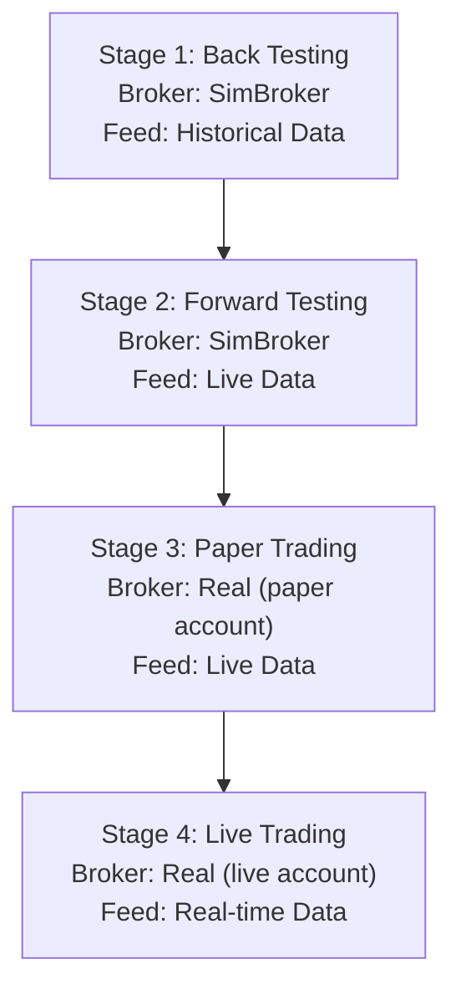

# The 4 Stages of Developing Algo-Trading Strategies

## Overview

When developing, testing, and running a new trading strategy, you typically go through 4 distinct stages. The diagram below illustrates these stages and their ideal sequence:

Each stage has its own specific purpose and advantages. However, before diving into the details, there are two golden rules to follow:

1. **Do not skip any stage if possible**. Each stage has its own raison d'être. Only by going through all of them will you eventually end up with a well-performing and robust strategy.
   
2. **If performance is unsatisfactory in a later stage, go back to stage 1**. Usually, small changes in code can have a big impact on results, so thorough testing at every stage is essential.

Roboquant supports all 4 stages, requiring only minimal configuration changes when moving from one stage to the next. Your `Strategy` and `Trader` should **not** change between stages; only the **Feed** and **Broker** configurations differ.

The mapping of Brokers and Feeds per stage is as follows:

| Stage | Broker | Feed |
|---|---|---|
| Back Testing | SimBroker | Historical Data |
| Forward Testing | SimBroker | Real-time Data |
| Paper Trading | Real Broker (using simulated account) | Real-time Data |
| Live Trading | Real Broker (using real account) | Real-time Data |

---

## Stage 1: Back Testing

In this stage, you will test your `Strategy` and `Trader` against historical data using the `SimBroker`.

You can run a single backtest over a complete historical timeline, but Roboquant also makes it easy to perform **walk-forward analysis** and **Monte Carlo simulations**. These types of backtests give you a better understanding of how your strategy performs under different market regimes.

**The core goal** of this stage is to gather as much information as possible about the overall performance and behavior of your strategy, so you know **what to expect**—and **what not to expect**—when going live.

**Important principle**: This is the **only** stage where you should develop and modify your strategy and rules. If performance in a later stage is disappointing, you should return to this stage to make adjustments. For example, if you want to use a circuit breaker to add peace of mind during live trading, you should include this logic during backtesting, not introduce it only during live execution.

**Configuration tips**:
- Configure your `SimBroker` to be as similar as possible to the real trading account and broker you plan to use.
- Set realistic costs and initial deposits to avoid overly optimistic expectations about total costs.
- As a general rule, it is better to overestimate your cost structure than to underestimate it.

---

## Stage 2: Forward Testing

In this stage, you will test your `Strategy` and `Trader` using **real-time data** and the `SimBroker`.

**The main purpose** of this stage is to validate that your strategy still performs well on **unseen data**. It is easy to overfit during backtesting, and forward testing provides a crucial sanity check before risking any real capital.

**Why it matters**: While historical data provides a broad view, it does not reflect the current market microstructure, liquidity, or latency. Forward testing exposes your strategy to the live market environment in a risk-free manner, allowing you to observe how it reacts to real-world events like sudden news spikes or market opens/closes.

**Configuration tips**:
- Use the exact same `Strategy` and `Trader` code as in Stage 1.
- Switch your `Feed` from historical to a real-time source (e.g., WebSocket or REST API).
- Keep the `SimBroker` to simulate fills, slippage, and commissions in real-time without financial risk.

---

## Stage 3: Paper Trading

In this stage, you will run your strategy with **real-time data** and a **real broker**, but using a **simulated (paper) account**.

**The core goal** is to test the **integration** between your Roboquant application and your chosen broker's API. This stage validates that orders are properly formatted, transmitted, and acknowledged by the broker's system.

**Why it matters**: The interface between your trading system and the broker is a common point of failure. Issues such as authentication errors, rate limits, order type mismatches, or position synchronization bugs can be safely identified and resolved here without losing real money.

**Configuration tips**:
- Switch your `Broker` from `SimBroker` to the real broker's implementation (e.g., IBKR, Alpaca).
- Ensure your broker account is set to "paper" or "simulated" mode.
- Monitor the system for API latency, disconnections, and reconnection logic.

---

## Stage 4: Live Trading

This is the final stage, where you run your strategy with **real-time data** and a **real broker** using a **real money account**.

**The core goal** is to execute the strategy in the live market and generate returns according to your backtested expectations.

**Crucial practice**: Despite all prior testing, live trading often reveals unexpected challenges. Start with a **small position size** and gradually scale up as you gain confidence in the system's stability and performance.

**Risk management**: Even in this stage, you should continuously monitor your strategy. If the live performance deviates significantly from your backtested and forward-tested results, it may be a sign that market conditions have changed or that there is a bug that slipped through the cracks. In such cases, do not hesitate to pause the system and go back to Stage 1 for further investigation and refinement.

**Configuration tips**:
- Switch your broker account from "paper" to "live" mode.
- Begin with minimal capital allocation.
- Ensure comprehensive logging and monitoring are in place to track every trade and system event.

