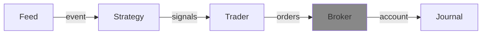

---
kernelspec:
  name: python3
  display_name: Python 3
---

# Broker
The broker is the component that handles the placed orders, either real or simulated during a back-test.

It is also the component owns the `Account` object. 

## API

## Account
Account is the main object owned by the Broker and 
returned when the `sync()` method is invoked.

It contains the latest state of the trading account and contains: cash, open positions in the portfolio, open orders, available buying power and excuted trades.

## SimBroker
The default broker for back-testing is the SimBroker (short for Simulated Broker). It has several configuration parameters and can be subclassed to change certain behavior.

