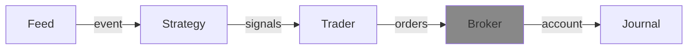

---
kernelspec:
  name: python3
  display_name: Python 3
---

# Broker



(broker_def)=
## Overview
The broker handles the placed orders, either real or simulated during a back-test.
It is also the component that owns the {cl}`Account` object. 

## API

The {cl}`Broker` base class defines the interface that all broker implementations must follow. The two core methods are:

- **`place_orders(orders: list[Order])`** — submit one or more orders to the broker. These orders are placed at the real broker which will likely sent them to an exchange.
- **`sync(event: Event) -> Account`** — synchronize the roboquant broker state with the real trading account state. Returns the updated {cl}`Account` reflecting cash, positions, open orders, and trades.
  
  :::{note}
  With higher frequency live trading, *roboquant* might not call the real broker at each step in order to avoid hitting API limits exposed by this broker.  
  :::


## Example

```{code-cell} python
:tags: [remove-input]
import roboquant as rq
from decimal import Decimal
from roboquant.common.event import Event, TradePrice

asset = rq.Stock("ABC")
broker = rq.brokers.SimBroker()
item = TradePrice(asset, 49.0, 1000)
event = Event(rq.utcnow(), [item])
```

```{code-cell} python
asset = rq.Stock("ABC")
order = rq.Order(asset, size=Decimal(100), limit=50.0)

broker.place_orders([order])

account = broker.sync(event)

print("trading price:", event.get_price(asset), "\n")
print(account)
```

Most users will not implement {cl}`Broker` directly but instead use {cl}`SimBroker` for back-testing or a third-party live broker.

## SimBroker
(simbroker_def)=
The default broker for back-testing is the SimBroker (short for Simulated Broker). It has several configuration parameters and can be subclassed to change even more of its behavior.

```{code-cell} python
from datetime import timezone
from roboquant import SimBroker, USD

broker = SimBroker(
  deposit = 1_000_000@USD, # initial available cash for trading
  price_type = "OPEN",     # what price type to use, fe. OPEN, ASK, CLOSE
  slippage= 0.0,           # what price slippage to apply, 0.01 is 1% 
  timezone = timezone.utc, # what timezone to use for validating DAY orders
  fee = 0@USD              # what additional fee/commission to apply per trade
)
```

Some of the implemented logic that might not be obvious at first:


- When `place_orders()` is invoked, orders are given an `id`. However the orders are NOT yet executed. That happens earliest in the next step
  of the run when the `sync()` method is invoked. So orders places at time{sup}`t`, will be earliest executed at time{sup}`t+1`.
- If there is no available price for an asset in the event, the corresponding orders will not be executed. They will stay in open state until
  a price becomes available.
- Only once there is a price available, the DAY time-in-force policy is started.

  :::{note} Example
  Suppose you place a `DAY` order on Saturday. No market events arrive on Saturday or Sunday, so the order stays open (the DAY timer hasn't started yet).
  
  On Monday, the first event arrives with a price for the asset — only now does the DAY policy begin.
  If the order isn't filled by the end of Monday's session, it expires at the end of that same day. 
  
  In other words, the clock starts ticking only when the market is actually open and a price is available, not when the order was placed. 
  :::

## Third party Brokers
Looks at [](../third_party/alpaca.md), [](../third_party/ibkr.md) and [](../third_party/crypto.md) for more details about
third party brokers.


## Live Broker
If developing your own Broker implementation, you can use the `LiveBroker` as a base-class.
To get started, best to look at some existing implementations like the `AlpacaBroker`. 
