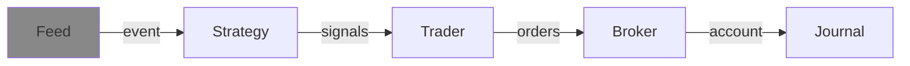

---
kernelspec:
  name: python3
  display_name: Python 3
---
# Feed




(feed_def)=
## Overview
A {cl}`Feed` represents a source of (financial) events that can be (re-)played to feed a {cl}`run()` with data.
Although the most common type of events are those containing market data, other types of events are also possible.
For example, events containing news items or social media posts could also be represented as a feed.

The feed is the driver of the run-loop: it produces the {cl}`Event` objects that all the other components
react to.


```{code-cell} python
:tags: [remove-input]
import roboquant as rq
rq.set_dark_style()
```

A {cl}`Feed` is also one of the main components that you swap when moving through the
[4 stages](../../concepts/4stages.md) of strategy development:

| Stage | Broker | Feed |
|---|---|---|
| Back Testing | SimBroker | Historical data |
| Forward Testing | SimBroker | Real-time data |
| Paper Trading | Real broker (paper account) | Real-time data |
| Live Trading | Real broker (real account) | Real-time data |

## Feed API
The {cl}`Feed` interface itself is deliberately small and consists of just two abstract methods.

- **`play(timeframe=None)`** — Returns an iterator of {cl}`Event` objects. Optionally, a {cl}`Timeframe` can be
  provided to only replay the events within that period. This is used for walk-forward and multi-run
  back tests.
- **`assets()`** — Returns the list of {cl}`Asset` objects that are contained in the feed.

```{code-cell} python
feed = rq.feeds.YahooFeed("MSFT", "AAPL", start_date="2020-01-01")
print(feed.assets())
```

Because a feed is an iterator of events, you can also play it manually. This is useful for debugging
or for writing your own custom run-loop.

```{code-cell} python
for event in feed.play():
    print(event.time, len(event.items))
    break
```

:::{note}
A {cl}`Feed` is only a source of data. It does not know anything about orders, positions, or cash.
Those are the responsibilities of the {cl}`Broker` and {cl}`Trader`.
:::

### Convenience methods
Most built-in feeds extend `HistoricFeed`, which adds a number of convenient helper methods on top of
the {cl}`Feed` interface:

- `symbols()` — the list of unique symbols in the feed.
- `get_asset(symbol)` — retrieve an {cl}`Asset` by its symbol.
- `get_ohlcv(asset)` — the OHLCV values of an asset as a {cl}`TimeSeries`.
- `to_timeseries(*assets)` — prices of one or more assets as a multivariate {cl}`TimeSeries`.
- `plot(asset)` — plot the prices (and optionally trades) of an asset, requires `matplotlib`.
- `count_events()` / `count_items()` — quick statistics about the contents of the feed.
- `track(metric)` — track a `Metric` over time and return the result as a {cl}`TimeSeries`.

Feeds that keep everything in memory (like `YahooFeed` and `CSVFeed`) extend `InMemoryFeed` and
additionally provide:

- `timeline()` — all unique timestamps in the feed.
- `timeframe()` — the {cl}`Timeframe` covered by the feed.
- `get_first_event()` / `get_last_event()` — the first and last event.

```{code-cell} python
print(feed.timeframe())
print(feed.symbols())
```

## Historic Feeds
Historic feeds contain data that was recorded in the past and can be replayed for back testing.
Roboquant ships with several built-in historic feeds, each with its own trade-offs in terms of
data source, speed, and memory usage:

| Feed | Description | Price Items |
|---|---|---|
| `YahooFeed` | Historic data retrieved from Yahoo Finance | `Bar` |
| `CSVFeed` | Historic data parsed from one or more CSV files | `Bar` |
| `ParquetFeed` | Historic data stored in a single Parquet file | `Bar`, `Trade`, `Quote` |
| `SQLFeed` | Historic data stored in an SQLite database | `Bar`, `Quote` |
| `RandomWalk` | Synthetic data generated by a random-walk model | `Bar`, `Trade`, `Quote` |

### YahooFeed
`YahooFeed` retrieves historic market data from Yahoo Finance. It is free to use and does not require
an API key. By default it retrieves daily bars, but you can specify a different interval.

```{code-cell} python
feed = rq.feeds.YahooFeed("TSLA", "MSFT", start_date="2015-01-01", interval="1d")
```

There is also a convenience factory method `us_stocks_10()` that returns a feed with 10 large US
stocks (MSFT, NVDA, AAPL, AMZN, META, GOOGL, AVGO, JPM, XOM, TSLA). Handy for quick experiments,
but note that this selection has a strong survivor bias.

```{code-cell} python
feed = rq.feeds.YahooFeed.us_stocks_10(start_date="2020-01-01")
```

### CSVFeed
`CSVFeed` parses one or more CSV files with historic market data. By default it expects the Yahoo
Finance column layout, but this can be customized via the `columns` parameter. The symbol is derived
from the filename.

```{code-cell} python
feed = rq.feeds.CSVFeed("path/to/csv/dir")
```

There are also ready-made class methods for specific formats, such as `stooq_us_daily()`,
`stooq_us_intraday()`, and `yahoo()`. An optional `asset_filter` allows you to load only a subset
of the assets in the files.

### ParquetFeed
`ParquetFeed` reads historic data from a single Parquet file. Parquet provides a good balance between
speed, memory usage, and disk usage, which makes it a great option to store large volumes of historic
market data for back testing. It supports a mix of `Bar`, `Trade`, and `Quote` price items.

Use the `record()` method to copy data from any other feed into a `ParquetFeed`:

```python
from roboquant.feeds.parquetfeed import ParquetFeed

feed = rq.feeds.YahooFeed("MSFT", "AAPL", start_date="2020-01-01")
target = ParquetFeed("data.parquet")
target.record(feed)
```

A demo file with 10 years of data for 10 popular US stocks is available through `us_stocks_10()`.
This is included for demo purposes and should not be relied upon for serious back testing.

### SQLFeed
`SQLFeed` supports recording price items from another feed and then playing them back during a run.
Under the hood, the data is stored in an SQLite database. The schema is created automatically when
the first item is recorded, and it differs for `Bar` and `Quote` items, so you can only store one
type of price item in a single database.

```{code-cell} python
feed = rq.feeds.SQLFeed("my_data.db", price_type="bar")
```

Use the `record()` method to copy data from another feed into the database. For large databases, you
can call `create_index()` after all data has been recorded to speed up queries for specific timeframes
(e.g. in walk-forward back tests).

:::{warning}
Databases can become very large if you record high-frequency market data over long periods.
:::

### RandomWalk
`RandomWalk` is a synthetic feed that simulates a random walk of prices. It can generate `Bar`,
`Trade`, or `Quote` price items and is very useful for testing and for building examples without
needing an internet connection.

```{code-cell} python
feed = rq.feeds.RandomWalk(n_symbols=5, n_prices=1_000, price_type="trade")
assets = feed.assets()
feed.plot(assets[0], plot_volume=False);
```

## Feed Transformations
Feeds can be wrapped by other feeds to transform the data they produce. This is a powerful way to
adapt a data source to the needs of a strategy.

### BarAggregatorFeed
`BarAggregatorFeed` aggregates the `Trade` or `Quote` items of another feed into `Bar` items of a
given frequency. When trades are selected, the actual trade prices and volumes are used. When quotes
are selected, the midpoint prices are used and volumes are not available.

```{code-cell} python
trades = rq.feeds.RandomWalk(n_symbols=2, n_prices=10_000, price_type="trade")
bars = rq.feeds.BarAggregatorFeed(trades, frequency="15m", price_type="trade")
```

### TimeGroupingFeed
`TimeGroupingFeed` groups events that occur closely after each other into a single event. It uses the
timestamps of the events to determine if they are close, based on a configurable timeout. This can be
useful to reduce the number of events when working with a chatty data source.

```{code-cell} python
trades = rq.feeds.RandomWalk(n_symbols=2, n_prices=10_000, price_type="trade")
feed = rq.feeds.TimeGroupingFeed(trades, timeout=5.0)
```

## Live Feeds
For forward testing, paper trading, and live trading you need a feed that produces real-time data
instead of replaying historic data. The abstract `LiveFeed` base class implements this and provides
two guarantees for the events it publishes:

- **Monotonic timestamps** — if a new event has a timestamp before or equal to the previous one, it
  is automatically corrected so that events always increase in time.
- **Heartbeats** — if no event is received within a configurable timeout, an empty heartbeat event is
  emitted so the run-loop keeps ticking.

Live feeds are typically paired with a live broker. Concrete implementations for specific brokers
(e.g. Alpaca) can be found in the `roboquant.third_party` module.

