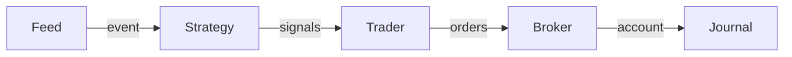

---
kernelspec:
  name: python3
  display_name: Python 3
---

# Core 
The core of the system is the {cl}`run()` function, which connects all components in a streaming event loop. At a high level, the run loop looks like this:

Each of these five components has its own responsibilities (clean separation of concerns):

| Component | Responsibility |
|-----------|---------------|
| **{cl}`Feed`** | Provides (market) data events |
| **{cl}`Strategy`** | Generates trading signals from events |
| **{cl}`Trader`** | Converts signals into orders (risk/sizing) |
| **{cl}`Broker`** | Executes orders, maintains account state |
| **{cl}`Journal`** | Logs/tracks every step (read-only) |

Each component is implemented an abstract base class with pluggable implementations, making every part of the pipeline independently swappable.

:::{note} Strategy/Trader Separation
This is an important design choice:

- **Strategies** produce signals from market data only. They implement `create_signals(event) -> list[Signal]` and have no access to account state. This keeps them pure, testable, and reusable across any trader configuration.
- **Traders** implement `create_orders(signals, event, account) -> list[Order]` and are responsible for risk management, position sizing, and order construction.
:::

