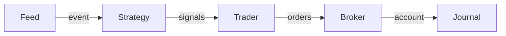

---
kernelspec:
  name: python3
  display_name: Python 3
---

# Core Components
The library is built around a clean separation of five orthogonal concerns:

| Component | Responsibility |
|-----------|---------------|
| **Feed** | Provides (market) data events |
| **Strategy** | Generates trading signals from events |
| **Trader** | Converts signals into orders (risk/sizing) |
| **Broker** | Executes orders, maintains account state |
| **Journal** | Logs/tracks every step (read-only) |

Each component is an abstract base class with pluggable implementations, making every part of the pipeline independently swappable.

## The Run Loop
The core of the system is the `roboquant.run()` function, which connects all components in a streaming event loop. At a high level, the run loop looks like this:

## Strategy/Trader Separation

This is the most important design choice in the library:

- **Strategies** produce signals from market data only. They implement `create_signals(event) -> list[Signal]` and have no access to account state. This keeps them pure, testable, and reusable across any trader configuration.
- **Traders** implement `create_orders(signals, event, account) -> list[Order]` and are responsible for risk management, position sizing, and order construction.
