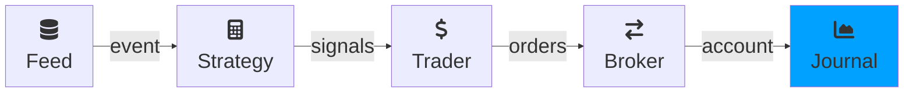

---
kernelspec:
  name: python3
  display_name: Python 3
---

# Journal


(journal_def)=
## Overview
A journal captures and/or logs information at each step of a {cl}`run`. It is optional and if you
don't provide one during a run, there is only the returned account at the end of the run to see what happened. 

A journal should NOT modify any of the passed parameters.


## API
The API of the Journal is a single `track(...)` method with all signals and orders generated during this step.

Below is a custom Journal that prints all the available info to the console at each step of the run.

```{code-cell} python
from roboquant.journals import Journal
from roboquant.common import Event, Account, Signal, Order

class MyJournal(Journal):
  
    def track(self, event: Event, account: Account, signals: list[Signal], orders: list[Order]) -> None:
        print(f"event={event} account={account} singals={signals} orders={orders}")
```


## BasicJournal
The BasicJournal has low overhead and tracks the following information:

- total number of events, and items
- the total number of signals and orders
- the maximum open positions
- the total number of trades
- the total number of unique assets

It will also log these values at each step in the run at `info` level.

(metricsjournal_def)=
## MetricsJournal

`MetricsJournal` collects and records metrics throughout a run, making it easy to track performance indicators like P&L, Sharpe ratio, drawdown, and custom metrics.

```{code-cell} python
import roboquant as rq

from roboquant.journals import MetricsJournal
from roboquant.util.metrics import PNLMetric, RunMetric

feed = rq.feeds.YahooFeed.us_stocks_10()
strategy = rq.strategies.EMACrossover(12, 25)

# Collect P&L, run metrics, and account-level metrics
journal = MetricsJournal(PNLMetric(), RunMetric())
account = rq.run(feed, strategy, journal=journal)

# Inspect recorded metrics as a time-series (DataFrame)
df = journal.get_metrics("pnl/equity")
print(df.tail())
```

You can also develop custom metrics by subclassing `Metric` and
implement the `calc()` method.

```{code-cell} python
from roboquant.common.metric import Metric

class PositionCount(Metric):
    """Counts the number of open positions at each step."""
     
    def calc(self, event, account, signals, orders) -> dict[str, float]:
        return {
            "positions": float(len(account.positions()))
        }

```

(tensorboardjournal_def)=
## TensorBoardJournal
This journal is similar to the MetricsJournal, but rather than keeping the results of
the metrics in memory it will write them to a TensorBoard compatible file.

So already during a run, the metrics can be inspected using a TensorBoard viewer.

```{code} python
from tensorboard.summary import Writer
import roboquant as rq
from roboquant.journals import TensorboardJournal
from roboquant.util.metrics import PNLMetric, RunMetric

feed = rq.feeds.YahooFeed.us_stocks_10()

# Compare runs with different parameters for the EMACrossover strategy
hyper_params = [(5, 10), (12, 25), (25, 50)]

for p1, p2 in hyper_params:
    # Each run will be logged to a different directory
    log_dir = f"runs/ema_{p1}_{p2}"
    writer = Writer(log_dir)
    journal = TensorboardJournal(writer, PNLMetric(), RunMetric())

    strategy = rq.strategies.EMACrossover(p1, p2)
    account = rq.run(feed, strategy, journal=journal)
    writer.close()
```

:::tip
Microsoft ships a free Tensorboard plugin for Visual Studio Code that makes it
possible to run the viewer from within the IDE.
:::

## SignalOrderTracker
(signalordertracker_def)=
This journal tracks the created `Signals` and `Orders` at each step of a run.

So these are the new Signals generated by the Strategy and any new orders created
by the Trader. This is regardless of the fact if Signals are converted into Orders,
or if the Orders are already processed by the {cl}`Broker`.

After the run you can access these orders and signals either directly or through 
some of the included convenience methods.

## Custom Journals
There are several reasons you might want to implement a custom Journal. For example, you want to
be notified on a messaging platform if something (like a new order) happens during a live
trading session.

(guard-journal)=
Another use case is a journal that guards some condition and stops the run if the condition is met.

```{code-cell} python
from roboquant import stop_run

class GuardJournal(Journal):
  
    def track(self, event: Event, account: Account, signals: list[Signal], orders: list[Order]) -> None:
        if account.cash_value() < 1_000:
            stop_run()
```