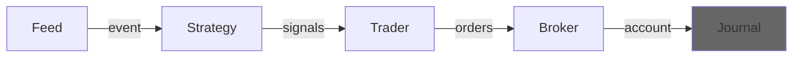

---
kernelspec:
  name: python3
  display_name: Python 3
---

# Journal
A journal allows you to capture information at each step of a run. It is completely optional and if you
don't provide one during a run, there is only the account to see what happened during the run. 



## API


## BasicJournal


## MetricsJournal


## TensorBoard

```{code} python
from tensorboard.summary import Writer
import roboquant as rq
from roboquant.journals import TensorboardJournal
from roboquant.util.metrics import PNLMetric, RunMetric

feed = rq.feeds.YahooFeed.us_stocks_10()

# Compare runs with different parameters for the EMACrossover strategy
hyper_params = [(5, 10), (12, 25), (25, 50)]

for p1, p2 in hyper_params:
    # Each run will be logged to a different directory
    log_dir = f"runs/ema_{p1}_{p2}"
    writer = Writer(log_dir)
    journal = TensorboardJournal(writer, PNLMetric(), RunMetric())

    strategy = rq.strategies.EMACrossover(p1, p2)
    account = rq.run(feed, strategy, journal=journal)
    writer.close()
```