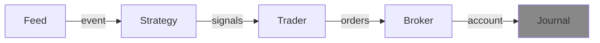

---
kernelspec:
  name: python3
  display_name: Python 3
---

# Journal
(journal_def)=
A journal captures and/or logs information at each step of a {cl}`run`. It is optional and if you
don't provide one during a run, there is only the account to see what happened during the run. 



A journal is one of the optional pameters of the `run()` function and if provided will be invoked at every step of the run.
A journal should NOT modify any of the passed parameters.


## API
The API of the Journal is a single `track(...)` method with all signals and orders generated during this step.

Below is a custom Journal that prints all the available info to the console.

```{code-cell} python
from roboquant.journals import Journal
from roboquant.common import Event, Account, Signal, Order

class MyJournal(Journal):
  
    def track(self, event: Event, account: Account, signals: list[Signal], orders: list[Order]) -> None:
        print(f"event={event} account={account} singals={signals} orders={orders}")
```

(guard-journal)=
Another example is journal that guards some condition and stops the run if the condition is met.

```{code-cell} python
class GuardJournal(Journal):
  
    def track(self, event: Event, account: Account, signals: list[Signal], orders: list[Order]) -> None:
        if account.cash[rq.USD] < 1_000:
            rq.stop_run()
```

## BasicJournal
The BasicJournal has low overhead and tracks a number of basic statistics.


## MetricsJournal

`MetricsJournal` collects and records metrics throughout a run, making it easy to track performance indicators like P&L, Sharpe ratio, drawdown, and custom metrics.

```{code-cell} python
import roboquant as rq

from roboquant.journals import MetricsJournal
from roboquant.util.metrics import PNLMetric, RunMetric

feed = rq.feeds.YahooFeed.us_stocks_10()
strategy = rq.strategies.EMACrossover(12, 25)

# Collect P&L, run metrics, and account-level metrics
journal = MetricsJournal(PNLMetric(), RunMetric())
account = rq.run(feed, strategy, journal=journal)

# Inspect recorded metrics as a pandas DataFrame
df = journal.get_metrics("pnl/equity")
print(df.tail())
```

You can also develop custom metrics by subclassing `Metric`:

```{code-cell} python
from roboquant.common.metric import Metric

class PositionCount(Metric):
    """Counts the number of open positions at each step."""
     
    def calc(self, event, account, signals, orders) -> dict[str, float]:
        return {
            "positions": float(len(account.positions()))
        }

```

## TensorBoardJournal
This journal is simular to the MetricsJournal, but rather than keeping the results in
memory it will write them to a TensorBoard compatible file.

So already during a run, the metrics can be inspected using a TensorBoard viewer.

```{code} python
from tensorboard.summary import Writer
import roboquant as rq
from roboquant.journals import TensorboardJournal
from roboquant.util.metrics import PNLMetric, RunMetric

feed = rq.feeds.YahooFeed.us_stocks_10()

# Compare runs with different parameters for the EMACrossover strategy
hyper_params = [(5, 10), (12, 25), (25, 50)]

for p1, p2 in hyper_params:
    # Each run will be logged to a different directory
    log_dir = f"runs/ema_{p1}_{p2}"
    writer = Writer(log_dir)
    journal = TensorboardJournal(writer, PNLMetric(), RunMetric())

    strategy = rq.strategies.EMACrossover(p1, p2)
    account = rq.run(feed, strategy, journal=journal)
    writer.close()
```

:::tip
Microsoft ships a free Tensorboard plugin for Visual Studio Code that makes it
possible to run the viewer from within the IDE.
:::