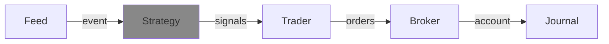

---
kernelspec:
  name: python3
  display_name: Python 3
---

# Strategy



(strategy_def)=
## Overview
The {cl}`Strategy` is responsible for creating signals based on incoming events from the feed. 
So a strategy doesn't generate the orders, that is the responsibility of a {cl}`Trader`.

Often the items in the event represent market data and the strategy uses this to perform some
type of (technical) analysis. But it is also possible for events to contain different data and,
for example, perform fundamental analysis.

Strategies are **pure decision-makers**. They only look at the {cl}`Event` and produce a list of {cl}`Signal`
objects. They have no knowledge of cash, positions, or risk — that is the domain of the {cl}`Trader`.


Because a strategy has no access to the account, the same strategy instance can be used unchanged
across all [4 stages](../introduction/development.md) of development. Only the {cl}`Feed` and {cl}`Broker` change
when moving from back testing to live trading.

## API
The {cl}`Strategy` base class has a single abstract method that you must implement:

- **`create_signals(event)`** — Create zero or more {cl}`Signal` objects based on the provided event.
  Return an empty list if no signals should be created.

The simplest possible strategy buys every asset that has a price in the event:

```{code-cell} python
import roboquant as rq

class MyStrategy(rq.strategies.Strategy):
    def create_signals(self, event: rq.Event) -> list[rq.Signal]:
        # Buy every asset that has a price in this event
        return [rq.Signal.buy(asset) for asset in event.price_items.keys()]

strategy = MyStrategy()
```

### Accessing prices
The most common thing a strategy does is inspect the prices in an event. The {cl}`Event` class provides
several helpers to make this easy:

- `event.price_items` — a dictionary mapping each {cl}`Asset` to its `PriceItem`.
- `event.get_prices(price_type)` — a dictionary of all prices of a given type (e.g. `"CLOSE"`).
- `event.get_price(asset, price_type)` — the price of a single asset, or `None` if not present.

```{code-cell} python
class PriceStrategy(rq.strategies.Strategy):
    def create_signals(self, event: rq.Event) -> list[rq.Signal]:
        result = []
        for asset, item in event.price_items.items():
            if isinstance(item, rq.Bar):
                open_, _, _, close, _ = item.ohlcv  # open, high, low, close, volume
                if close > open_:
                    result.append(rq.Signal.buy(asset))
                else:
                    result.append(rq.Signal.sell(asset))
        return result
```

A `PriceItem` also has a `price(price_type)` method. The available price types depend on the item:
`Bar` defaults to `CLOSE` (also supports `OPEN`, `HIGH`, `LOW`), `Quote` defaults to the mid-point
price (also supports `ASK`, `BID`), and `TradePrice` has a single price.

### Keeping state
A strategy can keep state between events, for example to track the recent price history of each asset.
The most convenient way is a dictionary keyed by asset:

```{code-cell} python
class MovingAverageStrategy(rq.strategies.Strategy):

    def __init__(self, period: int = 20):
        super().__init__()
        self.period = period
        self.history: dict[rq.Asset, list[float]] = {}

    def create_signals(self, event: rq.Event) -> list[rq.Signal]:
        result = []
        for asset, price in event.get_prices("CLOSE").items():
            prices = self.history.setdefault(asset, [])
            prices.append(price)
            if len(prices) > self.period:
                prices.pop(0)

            if len(prices) == self.period:
                avg = sum(prices) / self.period
                if price > avg:
                    result.append(rq.Signal.buy(asset))
                else:
                    result.append(rq.Signal.sell(asset))
        return result
```

## Base classes
In order to make it quicker to develop and test custom strategies, there are several base classes
that can be extended. They typically take care of collecting some data before invoking the core logic
of a strategy.

### IndicatorStrategy
`IndicatorStrategy` is an abstract base class for strategies based on technical indicators that use a
history of bars (aka candlesticks). It collects the bars of each asset into an `OHLCVBuffer` and only
invokes your logic once at least `period` bars are available for an asset.

Subclasses implement `_create_signal(asset, ohlcv)`, which receives the asset and its buffer of bars
and returns a single signal or `None`.

The `OHLCVBuffer` is a fixed-capacity FIFO buffer backed by a numpy array. It provides the methods
`open()`, `high()`, `low()`, `close()`, and `volume()`, each returning a numpy array of values.

```{code-cell} python
class MeanReversion(rq.strategies.IndicatorStrategy):
    def __init__(self, period: int = 20):
        super().__init__(period)

    def _create_signal(self, asset, ohlcv) -> rq.Signal | None:
        closes = ohlcv.close()
        if closes[-1] < closes.mean():
            return rq.Signal.buy(asset)
        return None
```

### MultiAssetIndicatorStrategy
`MultiAssetIndicatorStrategy` is similar to `IndicatorStrategy`, but it is designed to work with
multiple assets at the same time. This makes it possible to create signals based on the combined
history of several assets.

Subclasses implement `process_assets(data)`, which receives a dictionary mapping each asset to its
`OHLCVBuffer` and returns a list of signals. The method is only invoked for assets that have at
least `period` bars of data available.

```{code-cell} python
class RelativeStrength(rq.strategies.MultiAssetIndicatorStrategy):
    def __init__(self, period: int = 20):
        super().__init__(period)

    def process_assets(self, data) -> list[rq.Signal]:
        result = []
        for asset, ohlcv in data.items():
            closes = ohlcv.close()
            if closes[-1] > closes.mean():
                result.append(rq.Signal.buy(asset))
        return result
```

## Combining strategies
Multiple strategies can be combined into one using `MultiStrategy`. This allows you to compose
several independent signals into a single strategy.

When multiple strategies create a signal for the same asset, the `signal_filter` parameter controls
how the conflict is resolved:

- `"none"` (default) — return all signals and do not handle conflicts.
- `"first"` — the first signal for an asset prevails.
- `"last"` — the last signal for an asset prevails.
- `"mean"` — return the mean of the ratings; all signals become `ENTRY_EXIT`. If the mean is 0, no
  signal is created for that asset.

```{code-cell} python
s1 = rq.strategies.EMACrossover()
s2 = rq.strategies.IBSStrategy(0.3, 0.7)
combined = rq.strategies.MultiStrategy(s1, s2, signal_filter="mean")
```

## Out of the box
Although roboquant comes with several strategies out of the box, they are mainly included for demo
purposes.

Coming up with good performing strategies is what differentiates algo-traders and is the key part to
focus on. So whenever someone offers a strategy (for free or paid), be very suspicious.

:::{important}
Treat the built-in strategies as starting points or baselines, not as ready-made money machines.
Verify any strategy yourself with thorough back testing before risking real capital.
:::

| Strategy | Description |
|---|---|
| `EMACrossover(fast_period=13, slow_period=26)` | Emits a buy signal when the fast EMA crosses above the slow EMA, and a sell signal when it crosses below. Tracks each asset independently. |
| `BuyHoldStrategy(wait=0)` | Creates buy signals for all assets found in the events. Useful as a baseline to compare other strategies against. |
| `IBSStrategy(buy_threshold=0.2, sell_threshold=0.8)` | A mean-reversion strategy based on the Internal Bar Strength (IBS) indicator. Buys when the asset is oversold, sells when it is overbought. |

### Running a strategy
A strategy is used by passing it to the {cl}`run` function, together with a {cl}`Feed`. The other components
(`Trader`, {cl}`Broker`, {cl}`Journal`) use sensible defaults when not specified.

```{code-cell} python
feed = rq.feeds.RandomWalk(n_symbols=5, n_prices=1_000)
strategy = rq.strategies.EMACrossover(13, 26)
account = rq.run(feed, strategy)
print(account)
```


