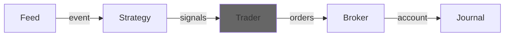

---
kernelspec:
  name: python3
  display_name: Python 3
---

# Trader
A trader is responsible for generating orders. It can do this based on the signals it receives, but also based on the event and latest version of the account.





## API

A very basic and naive implementation would look something like this:

```{code-cell} python
:tags: [remove-input]
from decimal import Decimal
import roboquant as rq
from roboquant.common.account import Account
from roboquant.common.event import Event
from roboquant.common.order import Order
from roboquant.common.signal import Signal
from roboquant.traders.trader import Trader
```

```{code-cell} python
class MyTrader(Trader):

    def create_orders(self, signals: list[Signal], event: Event, account: Account) -> list[Order]:
        orders = []
        for signal in signals:
            asset = signal.asset
            if price := event.get_price(asset):
                if signal.is_buy:
                    order = Order(signal.asset, 1, price)
                else: 
                    order = Order(signal.asset, -1, price)
                orders.append(order)
        return orders
```

## Order
All orders are limit orders in roboquant. If you want them to behave more like a market order,
you can set a generous `limit` price.

Also the only difference between a BUY and a SELL order is the sign of their `size`. So SELL orders
have a negative `size` and BUY orders a positive `size`.

There are 2 `tif` (time-in-force) values support, "DAY" and "GTC".

```{code-cell} python
asset = rq.Stock("AAPL")
buy_order = Order(asset, size = Decimal(10), limit = 200.0, tif="DAY")
sell_order = Order(asset, size = -Decimal(10), limit = 200.0, tif="GTC")
```

Existing orders are orders with a non empty `id`. This `id` is assigned by the broker. These orders
can be found in `account.orders` and contain the open orders only. Only these orders can be cancelled or modified. 

```{code-cell} python
:tags: [remove-input]
order = Order(rq.Stock("ABC"), Decimal(100), limit=50.0, id="1234")
```

```{code-cell} python
assert order.id
modified_order = order.modify(limit=51.0)
cancelled_order = order.cancel()
```

:::{tip}
If you want to track all orders during a run, use the `SignalOrderTracker` journal.
:::


## Out of the box

