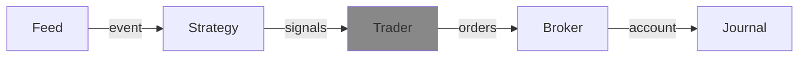

---
kernelspec:
  name: python3
  display_name: Python 3
---

# Trader
(trader_def)=
A trader is responsible for creating orders. It can do this based on the signals it receives, but also based on the latest version of the account.





## API

A very basic and naive implementation would look something like this:

```{code-cell} python
:tags: [remove-input]
from decimal import Decimal
import roboquant as rq
from roboquant.common.account import Account
from roboquant.common.event import Event
from roboquant.common.order import Order
from roboquant.common.signal import Signal
from roboquant.traders.trader import Trader
```

```{code-cell} python
class MyTrader(Trader):

    def create_orders(self, signals: list[Signal], event: Event, account: Account) -> list[Order]:
        orders = []
        for signal in signals:
            asset = signal.asset
            if price := event.get_price(asset):
                if signal.is_buy:
                    order = Order(signal.asset, 1, price)
                else: 
                    order = Order(signal.asset, -1, price)
                orders.append(order)
        return orders
```


## SimpleTrader
(simpletrader_def)=
The `SimpleTrader` is the default trader implementation in roboquant. 

As the name suggests, it implements a simple set of rules. This makes
is easier to understand what is going on, although not suitable for all
use cases.

Key characteristics:
- Configurable number of max open positions.
- The buying power is equally allocated over 
  the remaining free positions.
  
  :::{note} Example
  We configured 20 max positions. There is still 10,000 USD buying-power remaining
  and so far only 15 of the 20 max positions are allocted.

  An open order gets {math}`10,000/(20-15) = 2,000` USD allocated.
  ::: 
- A position will only be opened or closed, never increased or decreased.
   

## FlexTrader


