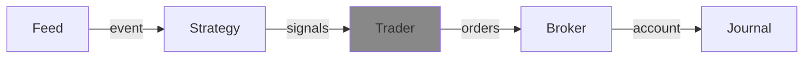

---
kernelspec:
  name: python3
  display_name: Python 3
---

# Trader
A trader is responsible for generating orders. It can do this based on the signals it receives, but also based on the event and latest version of the account.





## API

A very basic and naive implementation would look something like this:

```{code-cell} python
:tags: [remove-input]
from decimal import Decimal
import roboquant as rq
from roboquant.common.account import Account
from roboquant.common.event import Event
from roboquant.common.order import Order
from roboquant.common.signal import Signal
from roboquant.traders.trader import Trader
```

```{code-cell} python
class MyTrader(Trader):

    def create_orders(self, signals: list[Signal], event: Event, account: Account) -> list[Order]:
        orders = []
        for signal in signals:
            asset = signal.asset
            if price := event.get_price(asset):
                if signal.is_buy:
                    order = Order(signal.asset, 1, price)
                else: 
                    order = Order(signal.asset, -1, price)
                orders.append(order)
        return orders
```


## SimpleTrader


## FlexTrader


