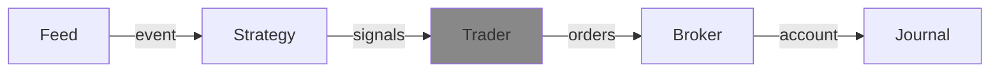

---
kernelspec:
  name: python3
  display_name: Python 3
---

# Trader
(trader_def)=
A trader is responsible for creating orders. It can do this based on the signals it receives, but also based on the latest version of the account.




```{code-cell} python
:tags: [remove-input]
from decimal import Decimal
import roboquant as rq
from roboquant.common.account import Account
from roboquant.common.event import Event
from roboquant.common.order import Order
from roboquant.common.signal import Signal
from roboquant.traders.trader import Trader
```


## API
The Trader API has 1 single method called `create_orders` that needs to be implemented:

```{code-cell} python

class MyTrader(Trader):

    def create_orders(self, signals: list[Signal], event: Event, account: Account) -> list[Order]:
        ...
```

Some of the typical logic:

- looks at the incoming signals to see what potential orders to create
- looks at open positions to see what to size for exit orders
- looks at buying power to see how much to allocate for an entry order
- looks at open orders to see if there is no conflict
- look at open positions to manage bad performing assets (risk management)
  

## SimpleTrader
(simpletrader_def)=
The `SimpleTrader` is the default trader implementation in roboquant. 

As the name suggests, it implements a simple set of rules. This makes
is easier to understand what is going on, although not suitable for all
use cases.

Key characteristics:
- Configurable number of max open positions.
- The buying power is equally allocated over 
  the remaining free positions.
  
  :::{note} Example
  We configured 20 max positions. There is still 10,000 USD buying-power remaining
  and so far only 15 of the 20 max positions are allocated.

  An open order gets {math}`10,000/(20-15) = 2,000` USD allocated.
  ::: 
- A position will only be opened or closed, never increased or decreased.
   

## FlexTrader
(fextrader_def)=
FlexTrader uses a percentage of the equity to determine the desired order sizes. 
So if your equity grows during a back test, so does the average order size.

Some of the features:

- support for fractional order sizes
- support for minimum and maximum order values (% of equity)
- support for limiting position sizes (% of equity)
- support for increase and decrease of position sizes
- extensive logging of the applied rules 
- can be subclasses to change behavior
- configurable order limit calculation 

## Custom Trader
If you have custom risk policies, you'll have to implement a custom trader. 
It requires a lot of testing to see if all edge cases are handled.

A very basic and naive implementation would look something like this:

```{code-cell} python
class MyTrader(Trader):

    def create_orders(self, signals: list[Signal], event: Event, account: Account) -> list[Order]:
        orders = []
        for signal in signals:
            asset = signal.asset
            if price := event.get_price(asset):
                if signal.is_buy:
                    order = Order(signal.asset, 1, price)
                else: 
                    order = Order(signal.asset, -1, price)
                orders.append(order)
        return orders
```

But this handles none of the challenges:

- How much should I allocate to a new order
- What to do with signals if there is already an open order for that signal
- What to do with open positions that have increasing unrealized losses (or profit) 
- Am I not generating too many orders (especially a concern for higher frequency price-data)

:::{note}
When using the account in a custom {cl}`Trader` it is important to use `buying_power` and not `cash` 
to determine the available budget for orders.
:::


